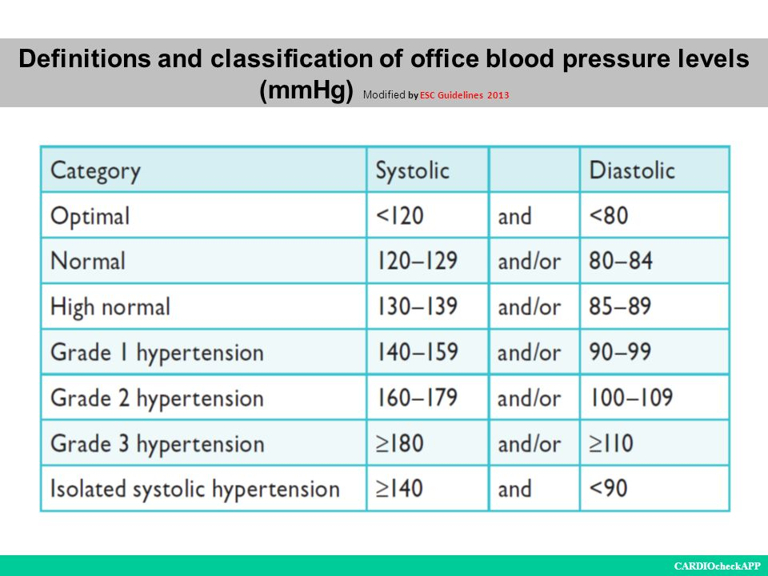
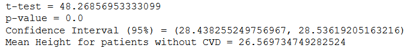
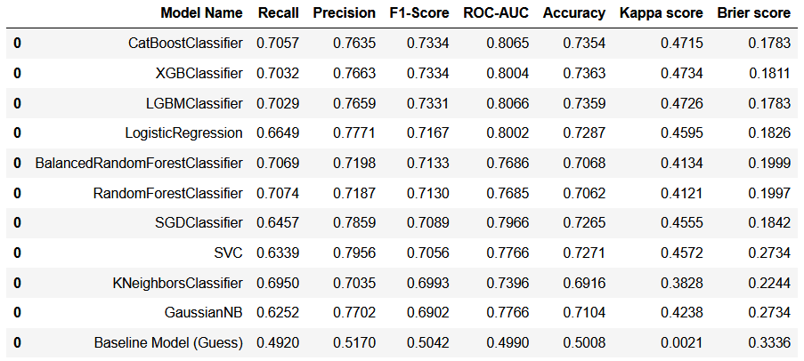

# Predicting Cardiovascular Diseases

_This project uses synthetic data from Kaggle that contains patient records across 12 features. The dataset can be found at [Kaggle - Cardiovascular Disease dataset.](https://www.kaggle.com/sulianova/cardiovascular-disease-dataset). Header image retrieved [here.](https://www.augustahealth.com/sites/default/files/blog/hands-cupped-around-a-heart.jpg)_

In this project, we will explore a classic classification problem: **to predict whether a patient has cardiovascular disease or not based on 70,000 patient records.** A business situation will be set in order to guide our analysis throughout the project.

This readme will contain the following points:
1. How to tackle a classification problem of two labels;
2. Explore classification algorithms and understand their differences;
3. A summary of the main insights obtained from the data from a business perspective;

**The project management methodology** used for this classification project was the **Cross Industry Standard Process for Data Mining (CRISP-DM)**, and the outcomes presented in this readme reflects the 2nd CRISP-DM cycle with satisfactory results.

### How to read this README.MD?

1. If you wish to **check the codes for this project**, access the Jupyter notebook [here](https://github.com/alanmaehara/cardiovascular-analysis/blob/master/cardiovascular-diseases-001.ipynb);
2. A [(go to next section)]() hyperlink will be available for each section to make your reading smoother, and a [(skip theory)]() hyperlink will be there to skip technical explanations. 

I would appreciate any comments or suggestions on how to improve this project. Please feel free to add me on GitHub or [Linkedin](https://www.linkedin.com/in/ammaehara/) - I will get back to you as soon as possible. 

With no further due, let's get started!

---
## Table of Contents
- [A brief introduction to CVDs](#a-brief-introduction-to-cvds)
- [01. The Business Problem and Deliverables](#01-the-business-problem-and-deliverables)
- [02. Data Preparation and Feature Engineering](#02-data-preparation-and-feature-engineering)
- [03. Exploratory Data Analysis (EDA)](#03-exploratory-data-analysis-eda)
- [04. Data Preprocessing and Feature Selection](#04-data-preprocessing-and-feature-selection)
- [05. Machine Learning Modeling](#05-machine-learning-modeling)
- [06. Hyperparameter Tuning](#06-hyperparameter-tuning)
- [07. Business Performance](#09-error-interpretation-and-business-performance)
- [Conclusion](#conclusion)

---
## A brief introduction to CVDs

[(go to next section)](#01-the-business-problem-and-deliverables)

Before we jump to the business problem, a brief introduction to cardiovascular diseases (CVDs) is of help. According to [heart.org](https://www.heart.org/en/health-topics/consumer-healthcare/what-is-cardiovascular-disease), CVDs can refer to a number of conditions:

- **Heart Disease**: this is commonly connected with a process called _atherosclerosis_ - which is a condition that a substance called "plaque" builds up in the arteries' walls. Once the walls are blocked, a heart attack or a stroke can happen;
- **Heart Attack**: this is the consequence of a heart disease. When a heart attack happens, part of the heart muscle that is supplied by the blocked artery begins to die.
- **Stroke**: there are two types of strokes, ischemic and hemorrhagic. An ischemic stroke occurs when a blood vessel that feeds the brain gets blocked. Depending on the blood vessel affected, this can lead to the loss of the brain functions pertaining to that area. A hemorrhagic stroke occurs when a blood vessel within the brain bursts. One of the factors that contribute to hemorrhagic stroke is high blood pressure - hypertension.
- **Heart Failure or Congestive heart failure**: this is a condition where the heart isn't pumping blood well due to inappropriate levels of oxygen and blood.
- **Arrhythmia**: this is a condition of an abnormal heart rhythm. There are two types of arrhythmia: Bradycardia (too slow heart rate - less than 60 BPM) and Tachycardia (too fast heart rate - more than 100 BPM);
- **Heart Valve Problems**: a type of problem related to the openness of heart valves. If valves aren't opened enough to allow the blood to flow, or don't close enough, or still the valve prolapses (change its position), then a heart valve problem is identified.

#### Causes of CVDs

According to the [United Kingdom National Health Service (NHS)](https://www.nhs.uk/conditions/cardiovascular-disease/), the exact causes of CVD aren't clear but there are risk factors that increase the chance of getting a CVD:

- **High Blood Pressure**: one of the most important risk factors for CVD. If your blood pressure is high, it can lead to damages in your blood vessels;
- **Smoking**: tobacco substances can also lead to damages in the blood vessels;
- **High Cholesterol**: high LDL (Low Density Lipoproteins) cholesterol levels can narrow blood vessels and increase the chance of developing blood clots;
- **Diabetes**: a disease that causes one's blood sugar level to increase. High blood sugar levels can also damage blood vessels, which in turn make blood vessels narrower;
- **Inactivity**: exercising regularly is one of the factors that contribute for a healthy heart. The lack of physical exercise increase the likelihood of developing high blood pressure, cholesterol and obesity - all risk factors of CVDs;
- **Obesity**: being obese or overweight can increase the risk of developing diabetes or high blood pressure, which are risk factors of CVDs. If your Body Mass Index (BMI) is 25 or above, you are at risk of developing CVDs - or if your waist is above 94cm (37 inches) for men, 80cm (31.5 inches) for women;
- **Family History of CVD**: high risk of having CVD is associated with family history of CVD. If your father or brother were diagnosed with CVD before the age 55, or your mother or sister were diagnosed with CVD before the age 65, you have a family history of CVD;
- **Ethnic Background**: CVD is more common in people that has association with high blood pressure or type 2 diabetes with their ethnic background. For instance, in the UK is common that people from South Asia, Africa, or Caribbean have an increased likelihood of getting CVD;
- **Age**: CVD is most common in people over 50;
- **Gender**: men are more likely to develop CVD at an earlier age than women;
- **Diet**: unhealthy diet habits can lead to high-blood pressure and high cholesterol, which in turn leads to high risk of getting CVDs;
- **Alcohol**: excessive consumption of alcohol can lead to high-blood pressure and high cholesterol.

Since hypertension is one of the main risk factors for CVD, it is important to know the threshold values that characterizes a person's blood pressure level. We interpret blood pressure levels by using two values: systolic and diastolic. According to [healthline.com](https://www.healthline.com/health/diastole-vs-systole#TOC_TITLE_HDR_1):

> Your **systolic blood pressure is the top number on your reading**. It measures the force of blood against your artery walls while your ventricles — the lower two chambers of your heart — squeeze, pushing blood out to the rest of your body.

> Your **diastolic blood pressure is the bottom number on your reading**. It measures the force of blood against your artery walls as your heart relaxes and the ventricles are allowed to refill with blood. Diastole — this period of time when your heart relaxes between beats — is also the time that your coronary artery is able to supply blood to your heart.

A useful chart from [ESC Guidelines 2013](https://slideplayer.com/slide/7436245/) can be of help to interpret blood pressure:

&nbsp;

[back to top](#table-of-contents)

---
## 01. The Business Problem and Deliverables
[(go to next section)](#02-data-preparation-and-feature-engineering)

**Cardio Catch Diseases** is our fictional healthcare business specialized in cardiovascular disease (CVD) diagnostic services. **The firm's revenue streams come only from CVD diagnostics**; therefore, some of the ways the firm can increase its profit are by:

1. Adding complementary services to the existing one;
2. Increasing the customer base size;
3. Increasing the frequency of diagnostics per patient;
4. Raising service price
5. Reducing fixed and variable costs;
6. Increasing the number of sponsors;
7. Improve service quality and use performance-based pricing strategy 

Currently, the diagnosis of cardiovascular diseases is made manually by a team of specialists. **The current precision rate of the diagnosis varies between 55% and 65%**, due to the diagnosis' complexity and also the fatigue of the team who take turns to minimize the operation risks during the procedures. 

**The firm's price strategy is set as performance-based**: the better performance on diagnostics, the higher the price charged by the firm.

Details:
- **The cost of each diagnosis (including the devices and the payroll of the analysts) is around $1,000.00.** The price tag for the service varies according to the diagnosis precision achieved by the team of specialists. 

- **The client pays 500.00 for every 5% increase in diagnosis precision rate above 50%**. For example, for a precision rate of 55%, the diagnosis costs 500.00 for the client; while for a rate of 60%, the value is 1,000.00.

- **If the diagnostic accuracy is 50% or below, the customer does not pay for the service**.

**The firm's challenge is to stabilize the diagnostic's precision rate** in order to get more control over the future cash-flows of the firm. Since each diagnostic precision rate is unstable, the company wishes to use a more sophisticated tool than the existing one, which is a healthcare software solution that calculates precision according to some unknown thresholds on each of the following variables:

|Variable|Feature Type|Variable Name|Data Type|
|--|--|--|--|
|Age | Objective Feature | age | numerical, discrete (days)|
|Height | Objective Feature | height | numerical, continuous (cm) |
|Weight | Objective Feature | weight | numerical, continuous (kg) |
|Gender | Objective Feature | gender | categorical, binary (labels are unknown) |
|Systolic blood pressure | Examination Feature | ap_hi | numerical, continuous (mmHg) |
|Diastolic blood pressure | Examination Feature | ap_lo | numerical, continuous (mmHg) |
|Cholesterol | Examination Feature | cholesterol | 1: normal, 2: above normal, 3: well above normal |
|Glucose | Examination Feature | gluc | 1: normal, 2: above normal, 3: well above normal |
|Smoking | Subjective Feature | smoke | categorical, binary  |
|Alcohol intake | Subjective Feature | alco | categorical, binary |
|Physical activity | Subjective Feature | active | categorical, binary |
|Presence or absence of cardiovascular disease | Target Variable | cardio | categorical, binary |

where:
- Objective: factual information;
- Examination: results of medical examination;
- Subjective: information given by the patient.

_Assumption: except for gender, we will treat binary variable values as `1 = existence` and `0 = nonexistence` of the respective variable trait._ 

### Deliberables

A dataset of 70,000 past patients with information of all the variables shown in the table will be used in this project. The solution will be the creation of a model that predicts the existence of cardiovascular diseases on patients **by a precision rate of at least higher than 65%.** 

[back to top](#table-of-contents)

---
## 02. Data Preparation and Feature Engineering
[(go to next section)](#03-exploratory-data-analysis)

The dataset was split into training (67% of the entire data), test (20%) and validation data (13%). Data was split in the Data Preprocessing section for manipulation convenience. No missing values were found.

#### Data Dimensions (rows x columns)

  * Train dataset: 44,514 x 18 
  * Test dataset: 13,093 x 18
  * Valid dataset: 7,856 x 18

#### Outlier Analysis

Outliers for numerical variables were studied and removed accordingly (around 6.48% of the entire data). For more details on how the outliers were identified and removed, please access the [notebook.](https://github.com/alanmaehara/cardiovascular-analysis/blob/master/cardiovascular-diseases-001.ipynb)

In practice, one would consult the firm's business/medical team before removing outliers from the dataset. In this project, we made assumptions according to the medical literature as we identify outliers.

#### Descriptive Statistics

**Highlights**:
- **The shortest person** is 1,25m tall and **the tallest person** is 2,07m tall.
- **The fatest person** weights 180kg and the **thinnest person** weights 34kg.
- **The youngest person** is 30 years old and **the oldest person** is 65 years old.
- Patients in the dataset present **an elevated high blood pressure** on average.

#### Feature Engineering

In order to guide our feature engineering process (and later on, the [exploratory data analysis](#03-exploratory-data-analysis-eda)), a mindmap that connects the risk factors of CVD was created.

&nbsp;

Based on the available data, the new features created were:

- `systolic`: a categorical variable that indicates the systolic level of the patient according to the [ESC Guidelines 2013](https://slideplayer.com/slide/7436245/) chart.
- `diastolic`: a categorical variable that indicates the diastolic level of the patient according to the [ESC Guidelines 2013](https://slideplayer.com/slide/7436245/) chart.
- `sys_diast`: a categorical variable that indicates both the systolic and diastolic levels of the patient according to the [ESC Guidelines 2013](https://slideplayer.com/slide/7436245/) chart.
- `hyper`: A binary variable indicating 1 = presence of hypertension; 0 = otherwise. If at least one of the above new variables indicates that the patient has high blood pressure, patient will receive 1.
- `BMI`: numerical, continuous variable indicating the body mass index (BMI) of the patient.
- `cvd_risk`: a variable that measures CVD risk with a 0-10 scale. If zero, patients has very low risk of having CVD; 10 represents the opposite. The variable is a sum of the categorical variables glucose, cholesterol, smoke, alcohol, active, hyper, and bmi.

[back to top](#table-of-contents)

## 03. Exploratory Data Analysis (EDA)

[(go to next section)](#04-data-preprocessing-and-feature-selection)

### I. Univariate Analysis 

* **Target Variable (cardio)**: Classes are balanced and won't need any balancing technique.
  - Number of patients with CVD: 33,171
  - Number of patients without CVD: 32,292

* **Numerical variables (histograms)**: 

Highlights:
- **Age**: there is a concentration of patients aged 50 to 60;
- **Height**: distribution concentrates around height of 160cm in a normal shape;
- **Weight**: distribution is slightly shifted to the left. Data concentrated around 70kg;
- **Systolic Pressure (ap_hi) & Diastolic Pressure (ap_lo)**: Systolic and Diastolic measurements concentrated around 120/80mmHg - normal blood pressure;
- **BMI**: distribution is slighly shifted to the left, concentrated around 25; 
  
&nbsp;
* **Categorical variables (barplots)**

Highlights:
- **Gender**: There are almost twice patients of gender 1 than 2;
- **Cholesterol**: Number of patients with "well-above" cholesterol levels are 5x bigger than others;
- **Glucose**: Number of patients with "well-above" glucose levels are 5x bigger than others;
- **Smoke**: Number of non-smoker patients are 6x bigger than smokers;
- **Alcohol**: Number of patients who aren't alcohol consumers are 5x bigger than patients who are alcohol consumers;
- **Active**: Number of physically active patients are almost 5x bigger than sedentary patients;
- **Systolic**: Around 60% of patients have normal systolic levels. Grade 1 Hypertension patients make up for around 20% of patients, followed by "High Normal" (15%), Grade 2 Hypertension, and Grade 3 Hypertension patients;
- **Diastolic**: Around 70% of patients have normal systolic levels. Grade 1 Hypertension patients make up for around 20% of patients, followed by Grade 2 Hypertension, "High Normal", and Grade 3 Hypertension patients;
- **Systolic + Diastolic**: Around 50% of patients have normal blood pressure levels. Grade 1 Hypertension patients make up for around 20% of patients, followed by "Optimal", "High-Normal", Grade 2 Hypertension, "Isolated", and Grade 3 Hypertension patients;
- **Hypertension**: Around 60% of patients doesn't have hypertension;
- **BMI**: Around 70% of patients have normal or overweight BMI levels. Obesity Class 1 patients make up for around 20%, followed by Obesity class 2, class 3, and underweight.
- **CVD Risk Scale**: The scale suggests that around 90% of patients have very low or low risk of having CVD. 

&nbsp;
### II. Bivariate Analysis

Twelve hypotheses were derived from the mindmap and were examined against the target variable. Here we highlight three main hypotheses - if you wish to check for the complete list of hypotheses, see the [notebook](https://github.com/alanmaehara/cardiovascular-analysis/blob/master/cardiovascular-diseases-001.ipynb).

#### H4. The average height among patients with CVD and without CVD is different with a confidence interval of 95% 

**TRUE**: Since the p-value is less than the alpha value (0.05), the null hypothesis is rejected. In other words, **the average height of patients with CVD and the average height of patients without CVD are different.**

#### H10. The average BMI among patients with CVD and without CVD is different with a confidence interval of 95% 

**TRUE**: The p-value is very close to zero and lower than the alpha value (0.05). Since the mean BMI for patients without CVD is not in between the confidence interval, we reject the null hypothesis. Therefore, **BMI is relevant to determine whether a patient has a CVD or not**.

#### H11. More than 50% of patients have hypertension (Grade 1 Hypertension or above)

**TRUE**: **More than 50% of patients with CVD have hypertension.** CVD Patients without hypertension make up for \~43% of the dataset. Among patients without CVD, the proportion of hypertensive patients are lower than non-hypertensive patients.

#### Summary of Hypotheses

|Hypothesis|Verdict|
|--|--|--|
|1. More than 50% of patients with CVD are of gender 1.|True
|2. The proportion of CVD cases surpass of non-CVD cases in patients weighting above 90kg.|False
|3. The proportion of CVD cases surpass of non-CVD cases in patients aged 50 or above.|False
|4. The average height among patients with CVD and without CVD is different with a confidence interval of 95%|True
|5. More than 70% of patients with CVD are patients who smoke.|False
|6. More than 70% of patients with CVD are physically inactive.|False
|7. More than 70% of patients with CVD are under the "well above" glucose level category.|True
|8. At least 30% of patients with CVD are patients who drink alcohol.|False
|9. At least 30% of patients with CVD are under the "well above" cholesterol level category.|True
|10. The average BMI among patients with CVD and without CVD is different with a confidence interval of 95%|True
|11. More than 50% of patients have hypertension (Grade 1 Hypertension or above)|True
|12. More than 70% of patients with CVD have a CVD Risk Scale of "high" or above.|False

### III. Multivariate Analysis

For the multivariate analysis, we used the following correlation methods:
1. Pearson Correlation Coefficient for continuous variables;
2. Point-Biserial Correlation between continuous variables vs the binary target variable;
3. Cramér's V Correlation between categorical variables vs the binary target variable.

Pearson and Point-Biserial Correlations is shown in the same heatmap, while Cramér's V Correlation will be displayed in a different one.

#### Continuous Variables vs Target Variable

**Highlights**:
- Strong positive correlation between **weight** and **bmi**, **systolic (ap_hi)** and **diastolic (ap_lo)**;
- The target variable `cardio` has a mild positive correlation with **systolic (ap_hi)** and **diastolic (ap_lo)**, an almost zero correlation with **height**, and weak positive correlations with other variables;

#### Categorical Variables vs Target Variable

**Highlights**:
- Strong positive correlation between **hyper** and **sys_diast**, **hyper** and **diastolic **,  **hyper** and **systolic**;
- The target variable `cardio` has a mild positive correlation with **systolic**, **diastolic**, **sys_diast**, and **hyper**. 
- The target variable `cardio` has a weak positive correlation with **bmi_class_enc**, **cholesterol**, and **cvd_risk**. 
- The target variable `cardio` has a zero or almost zero correlation with **gender**, **gluc**, **smoke**, **alco**, and **active_scale**. 

[back to top](#table-of-contents)

---

## 04. Data Preprocessing and Feature Selection
[(go to next section)](#05-machine-learning-modeling)

#### Data Preprocessing
In this section, we have split the dataset into training, validation, and test. We did this for convenience of preprocessing the columns in the right order but avoiding leakage of training data into the other data.

Due to a profusion of outliers in numerical variables, we utilized the **RobustScaler** method on them. For categorical variables, we used the following criteria:

1. **Presence/absence of state**: gender, smoke, alco, active, hyper. Since these variables are binary ones indicating state, we will use **the One-hot Encoding**.
2. **Order of categories**: cholesterol, gluc, systolic, diastolic, sys_diast, bmi_class_enc, cvd_risk. Here we could have used an encoder that captures the frequency relationship between classes; however, each class has relevancy in terms of order. Therefore, the **the Ordinal Encoding method** was used.

#### Feature Selection

We have utilized three feature selectors to select the best features to our model:

1. **Boruta**: this wrapper method-based algorithm has selected only two variables: `ap_hi` (systolic values) and `bmi`. Since many relevant variables weren't selected, we won't use Boruta suggestion.
2. **Recursive Feature Elimination (RFE)**: Features `age`, `height`, `weight`, `ap_hi` were selected by the RFE. Since only `ap_hi` appeared in both RFE and Boruta, and many other relevant variables were excluded by both feature selectors, their recommendation won't be followed.
3. **Feature Importance**: we used the Logistic Regression, Random Forest Classifier, CatBoost Classifier, XGB Classifier and the LGBM Classifier to generate the importance of each feature on each respective model:

- **Logistic Regression**: `alco_0`, `active_0`, `cvd_risk`, `ap_lo`, `smoke_0`,`bmi_class_enc`, `gender_1` have almost zero coefficient. Many variables are closer to zero coefficient, so it seems that each variable contributes little to explain the target variable.
- **Random Forest Classifier & Balanced Random Forest Classifier**: `alco_0`, `alco_1`, `smoke_0`, `smoke_1`, `active_0`, `active_1`,  `gender_1`,  `gender_2`, 
 `gluc`, `diastolic`, `sys_diast`,  `bmi_class_enc` have score values very close to zero.
- **CatBoost Classifier**:  `smoke_0`, `smoke_1`,`gender_1`,  `gender_2`,`bmi_class_enc`,`alco_0`,`alco_1`,`diastolic`,`hyper_0`,`hyper_1`,`active_0`, `active_1`, have scores values very close to zero.
- **XGB Classifier**:`diastolic`,`systolic`,`hyper_1`,`alco_1`, `active_1`,`bmi_class_enc`,`smoke_1`,`gender_2`,  have scores values very close to zero.
- **LGBM Classifier**:`diastolic`,`systolic`,`hyper_0`,`hyper_1`,`alco_1`, `active_1`,`bmi_class_enc`,`smoke_1`,`gender_2`,  have scores values very close to zero.

According to the multivariate analysis and the features selected by the algorithms, we would drop the following variables:

- `bmi_class_enc`
- `gender_1`
- `gender_2`
- `smoke_0`
- `smoke_1`
- `alco_0`
- `alco_1`
- `active_0`
- `active_1`

However, we won't drop these variables since the medical literature has shown that there is a correlation between CVDs and these features. In a real situation, we would seek for more data to get robust results. Therefore, we will proceed as it is.

[back to top](#table-of-contents)

---
## 05. Machine Learning Modeling
[(go to next section)](#06-hyperparameter-tuning)

This section was divided into three tasks:
  
* **Performance Metrics**: choose suitable metrics to measure the performance of the predictive model;
* **Modeling:** choose machine learning models to train and generate predictions
* **Cross-validation:** assess the trained models' real performance by testing the model within 10 folds.

### I. Performance Metrics

Metrics for a classification project work differently from regression ones. In regression problems we are most concerned on reducing the error between the actual values and the predicted values, whereas in classification the concern is on maximizing the accuracy of the model. 

The term "accuracy" should be taken carefully, however. In classification, there are a myriad of metrics that measure the rate of right "guesses" against wrong ones; and it turns out that accuracy is just one of those metrics.

For problems in which the target variable has two labels (yes/no, positive/negative), **a confusion matrix** helps us calculating these metrics:

_Image retrieved from [Towards Data Science.](https://towardsdatascience.com/understanding-confusion-matrix-a9ad42dcfd62)_

In the top-side of the matrix we have the actual values, and in the right-side we have the predicted values generated from the model. In the squares, there are four variables:

- **True Positive (TP)**: The number of observations that the model correctly predicted to be positive;
- **False Positive (FP)**: The number of observations that the model predicted to be positive when the actual value was actually negative;
- **True Negative (TN)**: The number of observations that the model correctly predicted to be negative;
- **False Negative (FN)**: The number of observations that the model predicted to be negative when the actual value was actually positive;

In most situations, the desirable result would be to have zeroes in the FN and FP squares. This would indicate that the model accurately predicted the positive values as positive; and the negative values as negative.

There are lots of metrics to measure a model's capability of predicting TPs and TNs. A few of them will be explored now.

### Accuracy

$\large accuracy =  \frac{\# \ correct\ predictions}{\#\ predictions\ made} = \frac{TP + TN}{TP + TN + FP + FN} $

**Accuracy is the number of correct predictions made divided by the total number of predictions made**, multiplied by 100 to turn it into a percentage.

Accuracy is a baseline metric to evaluate performance of machine learning models. However, if your data has imbalance problems between classes, accuracy won't tell the whole story and will be not useful to measure performance. 

For example, let's say that a model X predicts whether a person is sick (1) or not (0). If the data that model X uses for training contains 90% of sick individuals, the model will be biased towards predicting unseen data as sick.

Now let's say that 900 people are indeed with the label "sick" (1) and 100 are labeled "not sick" (0). Suppose we train the model X on these past data, and we have generated predictions for 1000 observations coming from unseen data with the following results:

TP = 900
FP = 70
TN = 30
FN = 0

This model has accurately predicted all positives, while it poorly predicted the negatives (only 30/100 = 30% of correct predictions).

If one uses the accuracy formula presented above, we would get:

$\large accuracy =  \frac{930}{1000} = 0.93 $

An accuracy of 93% seems nice, but we know that the model didn't label non-sick patients accurately.

### Precision

$\large precision = \frac{TP}{TP + FP} $

Precision measures **how well a model predict positive labels**. Precision is a good measure when the costs of False Positive (say, patients without CVD but diagnosed with CVD) is high.

In the example we set, we would have a precision rate of:

$\large precision = \frac{900}{900 + 70} = 0.92 $

which basically says that the model has a 92% precision (or that the model predicted positive labels with an accuracy of 92%). 

In this project, we are dealing with a CVD detection challenge where the business earn \$500 for each 5% increase on precision in diagnostics. Therefore, improving precision is one of the key goals for the business.

### Recall

$\large recall = \frac{TP}{TP + FN} $

Also known as sensitivity (or true positive rate), recall calculates **how many of the True Positives the model capture among all positives** in the dataset. Recall is a good measure when there is a high cost associated with False Negatives (in our case, patients with CVD but diagnosed without CVD).

Applying the recall formula to our example:

$\large recall = \frac{900}{900 + 0} = 1$

As we expected, our model captures all true positives (100%).

We can also calculate the inverse of recall, which is the **specificity**. It measures **how many of the True Negatives the model capture among all negatives**:

$\large specificity = \frac{TN}{TN + FP} $

Applying the specificity formula:

$\large specificity = \frac{30}{30 + 70} = 0.3 $

which tells us that the model captures only 30% of all true negatives.

In this project, it will always be desirable to have diagnostics with a high recall rate from the patients' standpoint. The reason is simple: a low recall rate would be very costly for patients who have CVD, but are mistakenly diagnosed without CVD.

### F1-Score

$\large F_{1} = 2* \frac{precision \ * \ recall}{precision \ + \ recall} $

The F-measure or balanced F-score (F1 score) is the harmonic mean of precision and recall. **F1 Score is needed when you want to seek a balance between Precision and Recall.** 

For reasons already discussed in the precision and recall sections, we will use the F1-Score as one of the key metrics in this project. 

### Balanced Accuracy

A more reliable option to accuracy is the balanced accuracy. It is the average between the sensitivity (recall, or true positive rate) and specificity (the recall for negatives, or true negative rate):

$\large balanced \ accuracy = \frac{sensitivity + specificity}{2}$

In the case of sick patients, we would have the following result:

$\large balanced \ accuracy = \frac{1 + 0.3}{2} = 0.65 $

which is a more reliable metric than the 93% of accuracy we obtained earlier.

### AUC-ROC Score

**The Area Under the Curve - Receiver Operating Characteristics (AUC-ROC) score** is an important metric to evaluate a model's performance for classification problems. 

To understand the AUC-ROC score, we will explore the ROC curve above. The x-axis is the True Positive Rate (or Recall/Sensitivity), and the y-axis is the False Positive Rate (or 1 - Specificity). The ROC curve is the curve indicated by the 'ROC' in blue letters, and the AUC is literally the area under the the ROC curve. **This area is the AUC-ROC score**; therefore, since the range of both axis is 1, we are talking about a squared area that can take the maximum value of 1 and a minimum value of 0.

A quick definition on TPR and FPR:

- **True Positive Rate** is the recall (or sensitivity). As we discussed earlier, it is the proportion of patients correctly classified as sick among all patients with sickness.
- **False Positive Rate** is the proportion of patients incorrectly classified as sick (False Positives - FP) among all patients who are not sick (FP+TN). It can also be calculated by subtracting the specificity from 1.

To get the TPR and FPR values in our sick-or-not-sick example, we need to train a model and generate probabilities of patients being sick. Suppose we have a trained model and we want to test the model against five patients that we know their true health condition:

Then we generate probability predictions for these patients by using the trained model:

Now we need to set a probability threshold to determine whether the patient is sick or not. Let's check for a threshold of 0.50. If a patient has a predicted probability higher than 0.50, then it will be labeled as sick; otherwise, labeled as not sick:

With a 0.50 threshold, we have 2 patients who are sick, and 3 not sick. However, the model predicted two patients incorrectly. The confusion matrix shows the final outcome:

Now let's calculate the TPR and FPR for this specific threshold:

$\large TPR/recall = \frac{TP}{TP + FN} = \frac{2}{2 + 1} = 0.66 $

$\large FPR/ = 1 - specificity = 1 - \frac{TN}{TN + FP} = 1 - \frac{2}{2 + 0} = 0 $

Then we plot the resulted values in the AUC-ROC plot:

Okay, we got one point in our plot. Seems like the model with threshold 0.50 is very good in avoid false negatives (FPR = 0), but not perfectly good in predicting true positives (TPR = 0.66).

So what if we try **different thresholds** other than 0.50? Say, 0.10, 0.20, 0.30.... 0.90? Then we would get new TPs, TNs, FPs, TNs, and new TPR and FPR values. At the end of the day, we would have many points in our graph:

It turns out that **the union of these points is the ROC curve**, and **the area under the curve is the AUC-ROC score** for the trained model utilized in this example:

**Ideally, we would have a AUC-ROC curve that represents the total area of a square (AUC-ROC score = 1)**. This means that, at a certain threshold, our model has a True Positive Rate of 1 (100% of patients correctly classified as positives), and a False Positive Rate of 0 (no false positives generated by the model). In our project, a AUC-ROC score of 1 means that the model predicts patients with CVD and without CVD correctly. In the plot, this excellent point is located where the y-axis correspond to 1 and x-axis is equal to 0:

The worst situation is when the AUC-ROC curve is 45º degrees, which means that every TPR has the same value as the FPR. For certain thresholds, the model is accurate to predict true positives but completely innacurate predicting negatives (TPR = FPR = 1), or the opposite: completely innacurate predicting positives but accurate predicting negatives (TPR = FPR = 0). 

Another type of situation is when the AUC-ROC score (the area under the ROC curve) is zero. Then we see an unusual behavior: the model predicts all positives as negatives, and negatives as positives:

In summary, the ROC curve is a summary of all TPR/FPR outcomes that are generated by different threshold values by a model. 

The area under the curve (AUC) is also useful to compare the performance of different models, such as this one:

In this example, we are comparing the XGB Classifier model and the Logistic Regression. By looking to their ROC scores (the area under the curve), we can conclude that the XGB model is better than the Logistic Regression across all thresholds.

Credit: this AUC-ROC explanation was inspired by the amazing explanation made by [Josh Starmer from StatQuest.](https://www.youtube.com/watch?v=4jRBRDbJemM)

Other sources are: [Towards Data Science - Sarang Narkhede](https://towardsdatascience.com/understanding-auc-roc-curve-68b2303cc9c5), [Machine Learning Mastery](https://machinelearningmastery.com/roc-curves-and-precision-recall-curves-for-classification-in-python/).

### Cohen-Kappa Score

The Cohen-Kappa score is a measure of interrater reliability. The metric calculates the reliability of votes given by two raters (say, rater A and rater B), who have the task to vote whether a particular sample (or patient, in our case) is sick or not:

$\Large k = \frac{p_{o} - p_{e}}{1 - p_{e}}
$

where,
$p_{o}$ = probability of agreement between raters
$p_{e}$ = probability of agreement between raters when each rater assigns labels randomly

Cohen-Kappa score values are always less than 1, being 1 equal to agreement between both raters about the decision made, and 0 equal to agreement by chance. If the score is less than 0, it means that the model is generating predictions that are worse than a model that randomly assign labels "sick" or "not sick" to patients (agreement by chance).

Let's set an example: 

In this example, we see a total of 10 votes where:
- Rater A assigned 5 patients as sick, and rater B agreed
- Rater A also assigned 2 patients as "not sick", and rater B agreed. 
- Rater A labeled 1 patient as sick, while rater B disagreed. 
- Rater A labeled 2 patients as "not sick", and rater B disagreed.

To calculate the probability of agreement between raters (Po), we sum the total of agreements (diagonal line) divided by the total votes:

$p_{o} = \frac{total\ of\ agreements}{total\ of\ votes} = \frac{7}{10} = 0.7$

Now we calculate the probability of agreement between raters when each rater assigns labels randomly (Pe). To help us during calculation, an updated table with totals is displayed below:

To get this probability, we calculate the following:

- **Probability that both raters agree on the label "sick" by chance**: probability of rater A assigning "sick" (6/10) **times** probability of rater B assigning "sick" (7/10).
- **Probability that both raters agree on the label "not sick" by chance**: probability of rater A assigning "not sick" (4/10) **times** probability of rater B assigning "not sick" (3/10);

Then we sum both probabilities:

$\large P_{e} = (\frac{6}{10} * \frac{7}{10}) + (\frac{4}{10} * \frac{3}{10}) = 0.42 + 0.12 = 0.54$

Now we can proceed to calculate the Cohen-Kappa score:

$\Large k = \frac{p_{o} - p_{e}}{1 - p_{e}} = \frac{0.7 - 0.54}{1 - 0.54} = \frac{0.16}{0.46} = 0.34
$

The Cohen-Kappa score of 0.34 means that, when two raters use a trained model to assign labels, they are 
References: [The Data Scientist](https://thedatascientist.com/performance-measures-cohens-kappa-statistic/), [Towards Data Science - Boaz Shmueli](https://towardsdatascience.com/multi-class-metrics-made-simple-the-kappa-score-aka-cohens-kappa-coefficient-bdea137af09c)

### Brier Score Loss

The Brier Score Loss (or Brier Score) measures the mean squared error between predicted probabilities of an outcome (say, patient has CVD) and the actual outcome. 

$\large Brier\ Score = \frac{1}{n}\displaystyle\sum_{i=1}^{n} (p_i - o_i)^2$

where,

$p_i$ = predicted probability that varies from 0 to 1
$o_i$ = actual outcome (either 0 or 1)

Given the nature of the formula, the brier score varies from 0(the best possible score) to 1 (the worst score). 

Let's set one example. Suppose that we have a model that predicts whether two patients have or not CVD. Their predicted probabilities of having CVD are:

P1 = 0.95 (patient 1 has 95% chance of having CVD)
P2 = 0 (patient 2 has 0% chance of having CVD)

Patient 1 is actually with a CVD, and patient 2 doesn't have CVD (the model was accurate). Translating it into the Brier Score formula, we have:

$\large Brier\ Score = \frac{1}{2}[(0.95 - 1)^2 + (0.00 - 0)^2] = 0.00125$

which is a very low Brier Score, showing that the model makes good predictions.

It is worth mentioning that the Brier Score is an accuracy metric suitable for models predicting binary outcomes (yes/no, true/false, positive/negative). 

### II. Modeling 

In this project, we trained 9 classifiers with the training and validation datasets. We got the following results:

From the table, the CatBoost Classifier, XGB Classifier, and LGBM Classifier are the three best performers in terms of F1-Score - which is the metric we are using as the primary criteria for choosing the best model to our project.

Before we proceed, let's explore each classifier and understand their mechanisms.

### 1. Random Guess (baseline)
The first model is a baseline. We randomly choose predicted values and compared with the actual values. This is supposedly the worst model performer from our set of chosen models; therefore, if a particular model
 performs worse than the baseline, we would not use it as the chosen one.

### 2. Logistic Regression

When the target variable is of binary type (yes/no, positive/negative) and there is a linear relationship between independent variables and the target, a logistic regression model can be used to predict probabilties of an observation belonging from a certain label.

While a [linear regression](https://github.com/alanmaehara/Sales-Prediction#2-linear-regression) model tries to fit a best line by using the Ordinary Least Squares (OLS) method, a logistic regression uses a technique called Maximum Likelihood Estimator (MLE). The reason is that, for dependent variables which allows for only two answers, and for independent variables who are linearly related to the dependent variable, fitting a straight line won't be the best choice: a curved, usually called sigmoidal curve, would be ideal:

In the example plotted above, we assume that weight of patients are linear to the probability of having CVD. 

If we define a probability threshold of .50, all patients who got a probability of having CVD above .50 will be labeled as having CVD (1), and zero otherwise. 

At this point, one can guess why should logistic models be avoided if your data is not linearly related. Imagine if weight has nothing to do with a higher chance of getting CVD, and the dots in the plot were shifted randomly across the x-axis. Then the logistic model would hardly capture data patterns that would accurately predict probabiltiies of a patient having CVD.

Linear regression models have some similar fundamentals to logistic regression ones. For instance, modeling a linear regression model is somewhat similar to a logistic regression: we have the coefficients for each independent variable, and we can calculate their values to check whether a specific variable explains better the phenomenon (dependent variable) than the others:

**Formula for linear regression (with one independent variable X1):**

$\large\hat{y} = \beta_{0} + \beta_{1}X_1$

where the $\beta$'s are the coefficients, the $\hat{y}$ is the predicted value, and the $X_1$ is the value of an independent variable (eg: if weight, it could assume values from 34 to 180 kg according to our data).

**Formula for logistic regression (with one independent variable X1):**

$\large\hat{y} = \ln(\frac{p}{1-p}) = \beta_{0} + \beta_{1}X_1$

Notice that there is a natural log term that represents the predicted value. **This is the natural log of the odds** (also called log-odds), in which _p_ is the probability of an individual having CVD and _1-p_ is the probability of not having CVD.

Why the natural log is utilized here? Let's take a look on the odds first. As an example, let's say that from 10 individuals weighting 80 kg, 8 have CVD and 2 doesn't. The probability of a patient to have CVD is 0.8 and the probability of not having CVD is 0.2. Then the odds of having CVD are:

$ odds\ of\ having\ CVD_1 = \large \frac{probability\ of\ having\ CVD_1}{probability\ of\ not\ having\ CVD_1} = \Large\frac{p}{1-p} = \frac{0.8}{0.2} = 4 $

Then let's calculate the odds of having CVD for patients weighting 50kg: 2 have CVD and 8 doesn't:

$ odds\ of\ having\ CVD_2 = \large \frac{probability\ of\ having\ CVD_2}{probability\ of\ not\ having\ CVD_2} = \Large\frac{p}{1-p} = \frac{0.2}{0.8} = 0.25 $

As one can tell, when the numerator is smaller than the denominator, odds range from 0 to 1. However, when the numerator is bigger than the denominator, odds range from 1 to infinity. This is the reason why logarithms are utilized in the logistic regression; **it is a measure to standardize output values across all probability values:**

$\large \ln(\frac{0.8}{0.2} )_1= 1.38$

$\large \ln(\frac{0.2}{0.8} )_2= -1.38$

With the natural log of the odds for these two specific cases on hands, we can figure out the probability of a patient with 50kg to have CVD and the probability of a patient with 80kg to have CVD. We do the following:

- Exponentiate the log-odds:

$\Large\ln(\frac{p}{1-p}) = \beta_{0} + \beta_{1}X_1$

$\Large\frac{p}{1-p} = e^{\beta_{0} + \beta_{1}X_1}$

- Do some algebra towards isolating p:

$\large p = \displaystyle \frac{e^{\beta_{0} + \beta_{1}X_1}}{e^{\beta_{0} + \beta_{1}X_1}+ 1} = \displaystyle\frac{1}{1+e^{-(\beta_{0} + \beta_{1}X_1)}}$

- We can translate the p as:

$\large p = \displaystyle\frac{1}{1+e^{-\ln(\frac{p}{p-1})}}$

If we plug the numbers we got earlier in the formula:

$\large p_1 = \displaystyle\frac{1}{1+e^{-1.38}} = \frac{1}{1+0.25} = 0.80$

$\large p_2 = \displaystyle\frac{1}{1+e^{1.38}} = \frac{1}{1+3.97} = 0.20$

which tells us that the likelihood of a patient with 80kg having CVD is 80%, and the likelihood of a patient with 50kg having CVD is 20%. If we plot the probability predictions in the plot, we see that they are indeed part of a sigmoidal curve:

But how to tell that the curve is a good fit for the data? This is where Maximum Likelihood Estimation (MLE) comes into play. Suppose that we have calculated likelihoods (probabilities) for all kinds of patients in our dataset, and we have fitted a curve like the first one we saw here:

Now imagine that we got the following likelihoods of having CVD for patients with CVD (0.70, 0.80, 0.90, 0.95) and for patients without CVD (0.10, 0.20, 0.30, 0.40). Them we calculate the log-likelihood of the model:

- Log-likelihood of having CVD:

$\ln(0.70) + \ln(0.80) + \ln(0.90) + \ln(0.95) = (-0.35)+(-0.22)+(-0.10)+(-0.05) = -0.72$

- Log-likelihood of not having CVD:

$\ln(1 - 0.10) + \ln(1 - 0.20) + \ln(1 - 0.30) + \ln(1 - 0.40) = (-0,10)+(-0.22)+(-0.35)+(-0,51) = -1.18$

- Summing up both log-likelihood: 

$-0.72 - 1.18 = -1.90$

With the current parameters, the logistic model has a log-likelihood of -1.90. Perhaps there are other parameters that could increase the log-likelihood value (the higher, the better), but this is a task that is efficiently done by any statistical software. 

In practice, logistic models can take more than one independent variable, which makes the model even more complex than the one we depicted here. 

Let's summarize the good and bad aspects of the Logistic Regression classifier:

**The good:**
- Like the linear regression, the logistic regression is a neat way to describe the effect of each independent variable on the target;
- Algorithm implementation is simple and fast, training is efficient;
- Overfitting can be avoided by using penalty techniques such as the L1 and L2.

**The bad:**
- Only works when the target variable is binary;
- Assumes linearity between independent variables and the target;
- Multicollinearity between independent variables is not permitted;
- It doesn't model non-linear data well.

Additional sources to build intuition:
- [Brandon Foltz's](https://www.youtube.com/watch?v=zAULhNrnuL4) series on Logistic Regression
- [Josh Starmer's](https://www.youtube.com/watch?v=vN5cNN2-HWE) videos on the topic
- [Application in python - Sklearn](https://scikit-learn.org/stable/modules/generated/sklearn.linear_model.LogisticRegression.html?highlight=logistic#sklearn.linear_model.LogisticRegression)

### 3. K-Nearest Neighbors (KNN) Classifier

The KNN Classifier is one of the simplest machine learning algorithms for classification. To classify an unknown data point to a certain class, it maps the K-nearest neighbors from that data point, analyze the labels of the K-data points selected, and the majority number of labels will determine the unknown data point label.

For example: choosing K=3, we detect that 2 patients labeled as "with CVD" and 1 patient labeled as "without CVD" are the nearest 5 neighbors from the unlabeled (unknown) patient. As the majority of the neighbors are with CVD, the unknown patient will be labeled as with CVD.

The following example uses only two features (height, weight) to plot the data points, but in practice this could be n-features.

For K = 5, we would have a different result:

To calculate the K-nearest neighbors, we calculate the distance (in most cases, the euclidean distance) between the unlabeled point and each labeled point. The K neighbors with minimum distance value are the K-nearest neighbors.

Now let's try to calculate the euclidean distance of the unlabeled point and all other labeled points. Suppose that we have the following dataset that resembles the graphs shown above:

The Euclidean distance is defined as:

$\large d(p,q) = \sqrt{\displaystyle\sum_{i=1}^{n}(p_{i}-q_{i})^2}$

In the example given, we would do like this for just two features (weight and height: n = 2). Features are represented by the letter i:

$\large d(p_{1},p_{2}) = \sqrt{\displaystyle\sum_{i=1}^{2}(p_{1i}-q_{2i})^2}$

$\large d(p_{1},p_{2}) = \sqrt{(p_{1height} - p_{2height})^2 + (p_{1weight} - p_{2weight})^2}$

$\large d(p_{1},p_{2}) = \sqrt{(1.5 - 1.4)^2 + (65 - 60)^2} \approx 5$

Therefore, the euclidean distance between patient 1 and patient 2 is 5. To speed up to conclusion, distances between patient 1 and other patients are displayed below:

If we picked K = 3, then we would choose patients 2, 3, and 4 as the 3-nearest neighbors to patient 1. Since patients 3 and 4 are with CVD, we would classify patient 1 as with CVD.

The optimal K number is defined in a stochastical way, although an odd-numbered K is recommended if the number of classes are even.

Let's summarize the good and bad aspects of the KNN classifier:

**The good:**
- No assumption on the data distribution is taken (non-parametric);
- Lazy algorithm: training is fast, since it does computation only for the testing phase;
- KNN usually performs fairly well when data has a small number of features
- Effective for large training datasets;
- Simple implementation.

**The bad:**

- Low values for k can generate noise and get affected by outliers;
- High values for k are not optimal when data has a few samples;
- Being a lazy learner algorithm means that the testing phase is slower;
- Due to the curse of dimensionality, the algorithm performance can be negatively affected when there are many features in the dataset;
- As K increases, so does computation cost.

Additional sources to build intuition:

- [KNN (K-Nearest Neighbors) #1 - Italo José (in Portuguese)](https://medium.com/brasil-ai/knn-k-nearest-neighbors-1-e140c82e9c4e)
- [KNN Classification using Scikit-learn - Datacamp](https://medium.com/brasil-ai/knn-k-nearest-neighbors-1-e140c82e9c4e)
- [Application in python - Sklearn](https://scikit-learn.org/stable/modules/generated/sklearn.neighbors.KNeighborsClassifier.html)

### 4. Naive Bayes

The Naive Bayes classifier is a probabilistic classifier based on the [Bayes' theorem](https://en.wikipedia.org/wiki/Bayes%27_theorem) that has two main assumptions: (1) features are independent from each other; (2) all features have equal importance (equal weight) to explain the target variable.

There are two main types of Naive Bayes classifiers: (1) the Multinomial Naive Bayes, which works best for categorical features; (2) the Gaussian Naive Bayes, which works for both categorical and numerical features under the assumption that all features belong to a normal (gaussian) distribution. To build intuition on the topic, we will focus on explaining the Multinomial Naive Bayes.

First, imagine that we have eight patients with CVD and four patients without CVD, and one patient whose health condition is unknown and we want to calculate the probability of having CVD for that particular patient. Features we would consider are four: alcoholic consumption, obesity, diabetes, hypertension. All of them indicates presence/absence (yes/no).

Let's use Naive Bayes to predict the probability of this unlabeled patient (P1) of having CVD based on the information we know from the eight patients. The Naive Bayes formula is as follows:

$\large P(y|X) = \Large\frac{P(X|y)P(y)}{P(X)}$

in which we can translate as:

$\large P(CVD|X) = \Large\frac{P(X|CVD)P(CVD)}{P(X)}$

where,

$X_i$ = all features of the dataset (hypertension, diabetes, obesity, alcohol);
$P(CVD|X)$ = probability of a patient having CVD given the features X are true (also called posterior);
$P(X|CVD)$ = probability of a patient having feature X given the patient has CVD;
$P(X)$ = probability of feature X across the entire data (also known as the prior probability of X);
$P(CVD)$ = probability of CVD across the entire data (also known as the prior probability of CVD);

Let's start by calculating the conditional probabilities. To better calculate them, we summarize the table we saw earlier in confusion matrices per feature:

Then, we calculate two probabilities: (1) the probability of patient 1 (P1) of having CVD given his own set of features; (2) the probability of patient 1 of not having CVD. Remember: patient 1 only has hypertension:

$ P(CVD|X_{p1}) = \large\frac{P(Hypertension|CVD)P(NoDiabetes|CVD)P(NoObesity|CVD)P(NoAlcohol|CVD)P(CVD)}{P(X_{p1})}$

$ P(NoCVD|X_{p1}) = \large\frac{P(Hypertension|NoCVD)P(NoDiabetes|NoCVD)P(NoObesity|NoCVD)P(NoAlcohol|NoCVD)P(NoCVD)}{P(X_{p1})}$

Since the denominator term is equal for both, we can get rid of it. Then we get the following numbers:

$ P(CVD|X_{p1}) = \large\frac{7}{8}*\frac{3}{8}*\frac{5}{8}*\frac{4}{8}*\frac{8}{12} \approx 0.068$

$ P(NoCVD|X_{p1}) = \large\frac{2}{4}*\frac{3}{4}*\frac{3}{4}*\frac{2}{4}*\frac{4}{12} \approx 0.046$

If one sums up both probabilities, they should be 1. Let's normalize them:

$ P(CVD|X_{p1}) = \large\frac{0.068}{0.068 + 0.046} \approx 0.5964$

$ P(NoCVD|X_{p1}) = \large\frac{0.046}{0.068 + 0.046} \approx 0.4035$

Since the probability of patient 1 having CVD given his features X is higher than the probability of not having CVD, we classify patient 1 as having CVD.

Let's summarize the good and bad aspects of the Naive Bayes Classifier:

**The good:**
- Very fast training compared to other classifiers;
- Can be modeled with a small training dataset; 

**The bad:**
- Assumes that variables are independent from each other. Therefore, it is not a good algorithm if there are dependent features in the dataset;
- Assumes that all variables have the same weight to determine the outcome;
- If assumptions are not met, probability outputs are not reliable (hence the name "naive");
- Testing phase: if a unknown class appears in the test dataset, a zero probability will be given. To avoid this, the Laplace estimation needs to be performed;

Additional sources to build intuition:

- For a similar example, check [geekforgeeks.org - Naive Bayes Classifiers](https://www.geeksforgeeks.org/naive-bayes-classifiers/);
- For Gaussian Naive Bayes, check [StatQuest by Josh Starmer](https://www.youtube.com/watch?v=H3EjCKtlVog);

### 5. Stochastic Gradient Descent (SGD) Classifier
### 6. Random Forest Classifier
### 7. Balanced Random Forest Classifier
### 8. XGB Classifier
### 9. CatBoost Classifier

&nbsp;

### III. Cross-Validation

[back to top](#table-of-contents)

---
## 06. Hyperparameter Tuning

[(go to next section)](#07-business-performance)

In this project, we will use the Random Search on the LGBM Classifier. The LGBM Classifier has the following parameters 

1. `objective`: parameter that sets the learning method and the loss function. In our model, we set `objective='reg:squarederror'` which is a regression with squared loss
2. `n_estimators`: number of trees
3. `eta`: the learning rate. A lower eta makes our model more robust to overfitting thus, usually, the lower the learning rate, the best. But with a lower eta, we need more boosting rounds, which takes more time to train, sometimes for only marginal improvements.
4. `max_depth`: maximum depth of a tree (or maximum number of nodes). Deeper trees can model more complex relationships by adding more nodes, but as we go deeper, splits become less relevant and are sometimes only due to noise, causing the model to overfit.
5. `subsample`: ratio of training sample (example: 0.5 means that XGBoost will randomly sample half of training data before growing trees. It prevents overfitting)
6. `colsample_bytree`: ratio from 0 to 1 representing the number of columns used by each tree.
7. `min_child_weight`: is the minimum weight (or number of samples if all samples have a weight of 1) required in order to create a new node in the tree. A smaller `min_child_weight` allows the algorithm to create children that correspond to fewer samples, thus allowing for more complex trees, but again, more likely to overfit.

We found out that the best set of parameters were:

`param_tuned = {'n_estimators': 1500,'eta': 0.03,'max_depth': 9,'subsample': 0.7, 'colsample_bytree': 0.9 ,'min_child_weight':8}`

Using the optimal set of parameters, we obtained the following results:

which had a MAPE improvement of 5%.

[back to top](#table-of-contents)

---
## 07. Business Performance
[(go to next section)](#conclusion)

[back to top](#table-of-contents)

---

## Conclusion

[back to top](#table-of-contents)